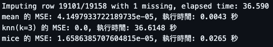
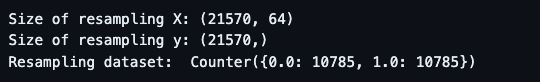
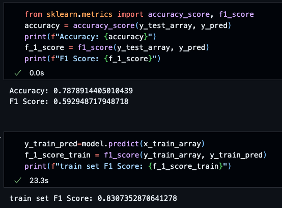
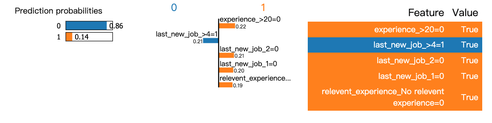
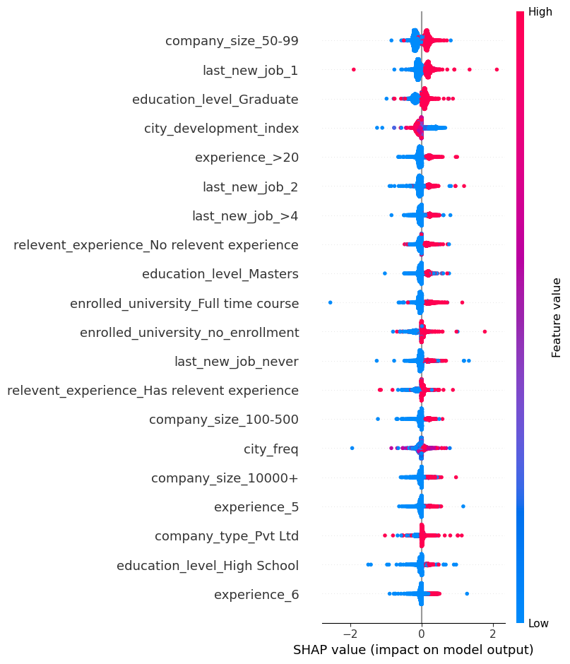
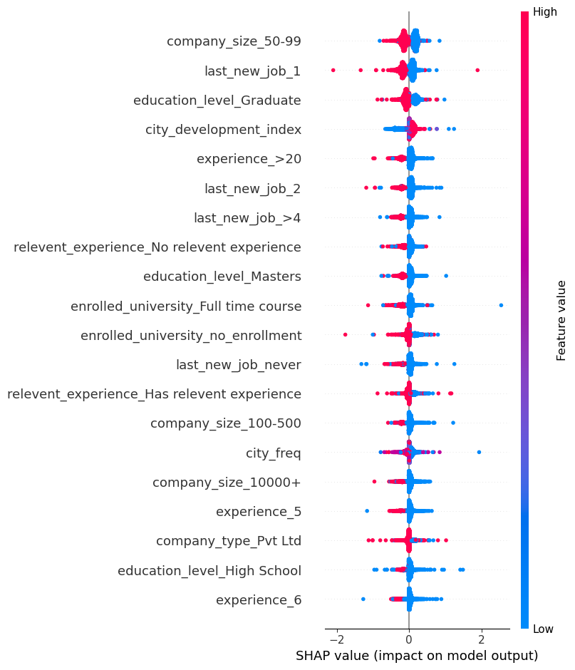

# Topic1 Assignment
Topic1: Machine Learning + sklearn

## Assignment List:
* hw_topic1.ipynb

## hw_topic1.ipynb
### 1. Missing Value Imputation
在第一個 TO-DO 中，我比較了三種補值方法（mean, knn, mice）的 MSE 以及執行時間，最終選擇 mice 作為本次作業的補值方法。

#### 1.1 Implementation

##### 儲存原始數據（未經缺值處理）
為計算三種補值方法的 MSE，需先儲存原始尚未丟失資料的數據。

```python
num_feat= df.drop("target",axis=1).select_dtypes("number").columns
original_values = df[num_feat] # original_values 為記錄的原始數據

# 隨機將200筆資料數值替換為缺失值
for col in num_feat:
    idx=np.random.choice(df.index,size=200,replace=False)
    df.loc[idx,col]=np.nan

missing_mask = df[num_feat].isna().to_numpy() # 紀錄失去的欄位

# id特徵不重要，刪除
df.drop("enrollee_id",axis=1,inplace=True)
original_values.drop("enrollee_id",axis=1,inplace=True) # 跟著 df 一起移除id

# performe frquent encoder (用該city出現的次數(數值型)來取代city(類別型))
city_freq=df["city"].value_counts(normalize=True)
df["city_freq"]=df["city"].map(city_freq)

original_values["city_freq"]=df["city"].map(city_freq)# 跟著 df 一起新增 city_freq
df.drop("city",axis=1,inplace=True)
```
##### 方法比較
```python
# 填補數值型特徵
########### TODO: 嘗試其他進階的填補方法(ex.MICE, KNN...) ##############
X = original_values.to_numpy() # original_values 從 dataframe 轉為 numpy array （與補值處理後的資料相同格式）

# Mean
start_time = time.time()
mean_imputer = SimpleFill(fill_method='mean')
X_filled_mean = mean_imputer.fit_transform(df[num_feat])
mean_mse = ((X_filled_mean[missing_mask] - X[missing_mask]) ** 2).mean()
mean_time = time.time() - start_time

# KNN
start_time = time.time()
knn_imputer = KNN(k=3)
X_filled_knn = knn_imputer.fit_transform(df[num_feat])
knn_mse = ((X_filled_knn[missing_mask] - X[missing_mask]) ** 2).mean()
knn_time = time.time() - start_time

# MICE
start_time = time.time()
mice_imputer = IterativeImputer()
X_filled_mice = mice_imputer.fit_transform(df[num_feat])
mice_mse = ((X_filled_mice[missing_mask] - X[missing_mask]) ** 2).mean()
mice_time = time.time() - start_time

# 結果
print(f"mean 的 MSE: {mean_mse}, 執行時間: {mean_time:.4f} 秒")
print(f"knn(k=3) 的 MSE: {knn_mse}, 執行時間: {knn_time:.4f} 秒")
print(f"mice 的 MSE: {mice_mse}, 執行時間: {mice_time:.4f} 秒")
#########################################################
```
#### 1.2 Result


發現：
* KNN 的補值結果最接近原始資料，但也花費最多執行時間
* 簡單的平均值補值差原始資料最多，執行起來也最快

最終決定使用 mice，其表現不錯，也不會花多時間

### 2. Class Imbalance Problem
#### 2.1 Implementation
使用 ADASYN 製作更多少數類的資料點

```python
########### TODO: 嘗試其他resampling方法 #############
# smote = SMOTE()
# x_train, y_train = smote.fit_resample(x_train, y_train)
resampling = ADASYN()
x_train, y_train = resampling.fit_resample(x_train, y_train)
############################
```
#### 2.2 Result


### 3. Classification Model
#### 3.1 Implementation
簡單比較三種模型（SVM, XGBoost, CatBoost）的準確率與 F1 Score

```python
########## TODO: 選擇你感興趣的model #############
# model = RandomForestClassifier()

# 定義一個函數來訓練和評估模型
def evaluate_model(model, x_train, y_train, x_test, y_test):
    model.fit(x_train, y_train)
    y_pred = model.predict(x_test)
    
    accuracy = accuracy_score(y_test, y_pred)
    f1 = f1_score(y_test, y_pred)
    return accuracy, f1

# 要比較的模型
models = {
    "SVM": svm.SVC(probability=True),
    "XGBoost": XGBClassifier(),
    "CatBoost": CatBoostClassifier(iterations=1000, depth=6, learning_rate=0.1, loss_function='MultiClass', verbose=0)
}

results = {}

# 訓練和評估
for model_name, model in models.items():
    accuracy, f1 = evaluate_model(model, x_train_array, y_train_array, x_test_array, y_test_array)
    results[model_name] = {"Accuracy": accuracy, "F1 Score": f1}

# 印出結果
for model_name, metrics in results.items():
    print(f"{model_name} - Accuracy: {metrics['Accuracy']}, F1 Score: {metrics['F1 Score']}")

model = svm.SVC(probability=True)
model.fit(x_train_array,y_train_array)
```

#### 3.2 Result


這裡選擇準確率與 F1 Score 都略高的 SVM

模型的最終結果：



### 4. Explainability
沒有 TO-DO，以當前模型去跑解釋器（shap.KernelExplainer 跑超級久，我也不知道到底跑了多久）

#### 4.1 LIME


LIME 提供某一筆資料的判斷解釋，結果圖顯示了模型預測這筆資料不尋找新工作的機率為 0.86，並提供了前五個影響較顯著的特徵。

可以發現，培訓者想找新工作的特徵是：
* 工作經驗不大於 20 年（ ↑ 22%）
* 上一份工作與當前工作的時間間隔不是兩年（ ↑ 21%）
* 上一份工作與當前工作的時間間隔不是一年（ ↑ 20%）
* 沒有相關經驗（ ↑ 19%）

而想繼續為公司工作的特徵是：
* 上一份工作與當前工作的時間間隔超過四年（機率 ↑ 21%）

#### 4.2 SHAP
##### 解釋特徵對label = 1(Looking for a job change)的影響


##### 解釋特徵對label = 0 (Not looking for job chang)的影響


可以從上兩張圖發現，影響判斷最明顯的特徵是 company_size_50-99, last_new_job_1, education_level_Graduate，幾乎可以觀察到 shap value 中線（0）切分了擁有高低 feature 值的資料點，使得有高 feature value 的資料位於終中線一側，而 feature value 低的資料會落於另一側。

## 說明一下你的發現吧
### 1. 哪些特徵對預測結果影響大?
我們可以從 SHAP 的結果看到全局的各特徵影響，影響最明顯的三者為：
* company_size_50-99：高值的特徵（紅色）對「尋找新工作」有正面影響，亦即，公司規模在 50-99 人的情況下，培訓者會更傾向於尋找新工作。
* last_new_job_1：最近一年內更換工作的培訓者（紅色部分）的 SHAP value 偏向正面，或可說明這類培訓者較可能尋找新的工作。
* education_level_Graduate：「學歷為研究生」這樣的特徵也對模型判斷有影響，高學歷值（紅色）的培訓者更容易被預測為尋找新工作。

同時，加上在 LIME 解釋器中，對單一個案的判斷結果，我們會發現：
* experience_>20=0: 沒有超過 20 年經驗的事實，對模型預測為 0（不尋找工作）有正面影響。
* last_new_job_>4=1: 上一份工作與當前工作的時間間隔超過四年，對預測為 0（不尋找新工作）也有顯著影響，影響值為 0.21。
* last_new_job_2=0 和 last_new_job_1=0: 上一份工作與當前工作的時間間隔不是兩年/一年，分別提供了 0.21 和 0.20 的正面影響，支持模型預測不尋找新工作。
* relevent_experience_No relevent experience=0: 沒有相關經驗，對預測為 1（尋找新工作）有正面影響。

總結兩項觀察，我們或許能初步判斷以下特徵或許是影響模型的重要因素：
* 上一份工作和當前工作的時間間隔（last_new_job系列）
* company_size
* education_level
* experience
* relevent_experience

### 2. 那些特徵如何影響結果? (EX.某特徵越大，該培訓者越可能找其他工作)
* company_size_50-99：公司規模在 50-99 人的情況下，培訓者更傾向於尋找新工作。
* last_new_job_1：最近一年內更換工作的培訓者較可能尋找新的工作。
* education_level_Graduate：高學歷的培訓者較可能尋找新的工作。
* relevent_experience_No relative experience: 沒有相關工作經驗者，較可能找新工作
* experience：
    * LIME：經驗未超過 20 年者，較可能找新工作
    * SHAP：經驗超過 20 年者，較可能找新工作

### 3. 你如何理解這些發現?

我認為這些解釋器提供的特徵與對結果得影響大致符合我所認知的世界，理由如下：
* 公司規模在 50-99 人的情況下，培訓者更傾向於尋找新工作：

    這點我稍微看不太出來，50-99 人應算是中小型公司，不確定為何這樣的公司留不住培訓者（且在公司規模在 100-500 與 10000+ 兩項者，其實都想換工作...，但想換的人看起來沒那麼多？或許能理解為大家稍微想在大公司工作一點點）
* 最近一年內更換工作的培訓者較可能尋找新的工作：

    兩份工作間隔期間較短者，或許本來就有容易換工作的傾向
* 高學歷的培訓者較可能尋找新的工作：

    高學歷者可能有更多其他的工作機會
* 沒有相關工作經驗者，較可能找新工作：

    這樣的培訓者更有可能發現工作不適合自己，或因為沒有領域的背景知識而容易打退堂鼓，尋求其他工作
* 年資：

    在這裡，兩個解釋器給出截然不同的回應。SHAP 認為經驗超過 20 年者，較可能找新工作，而 LIME 則相反。
    這裡我認為 LIME 的解釋似乎較為合理，在一份工作上年資越高，收入應也會越高，似乎沒有特別的理由去找一份新的工作