# Topic2 Assignment
Topic2: DNN & PyTorch

## Assignment List:
* 問答報告

## 問答報告
### 1.  Using the default settings, what is the best activation function?
A: ReLU，非常快就使 test loss 降到 0.001。

#### ReLU
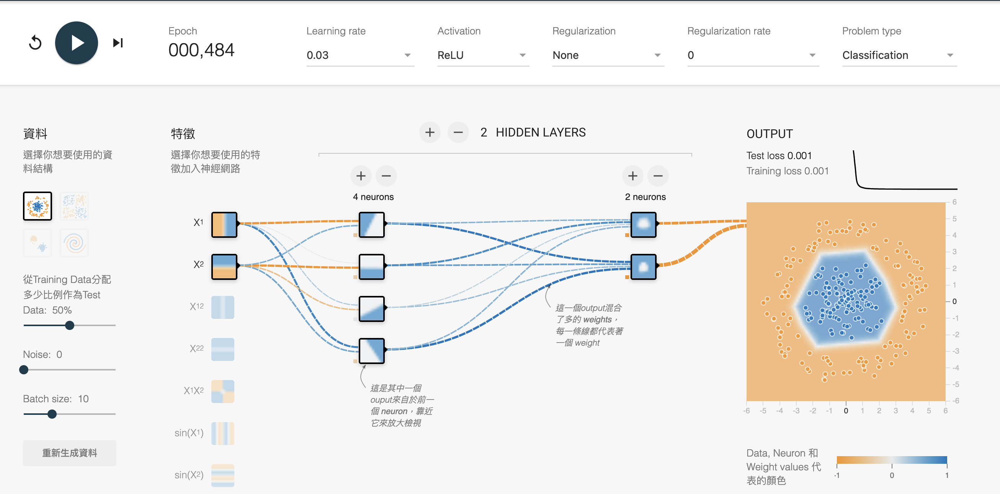

#### Tanh
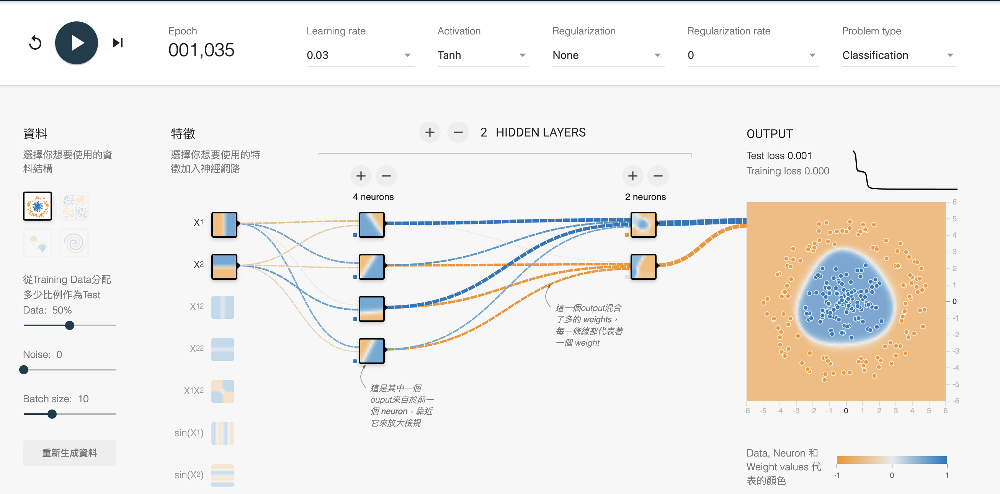
tanh 也能降到 0.001，但花費較多 epoch 

#### Sigmoid
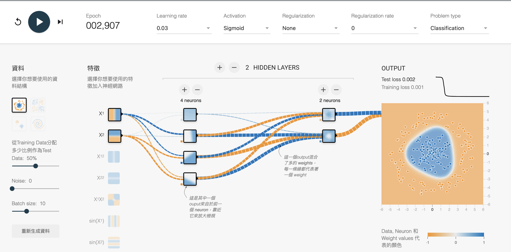
loss 趨於穩定後，test loss 為 0.002

#### Linear
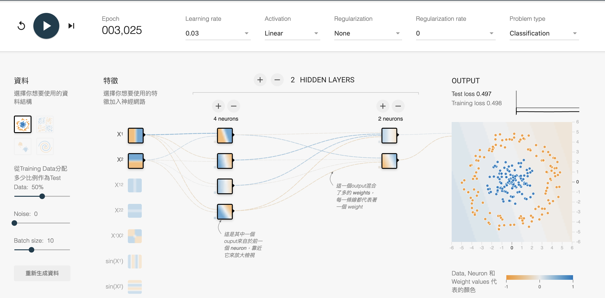
最糟糕的，無論花費多少時間，結果都是高達 0.497

### 2. Using the default settings, what happens if you increase # layer?
A: 增加 layer 似乎可以加速訓練時間與增強訓練結果。

原先使 test loss 降到 0.001 大約要 3-400 個epoch:
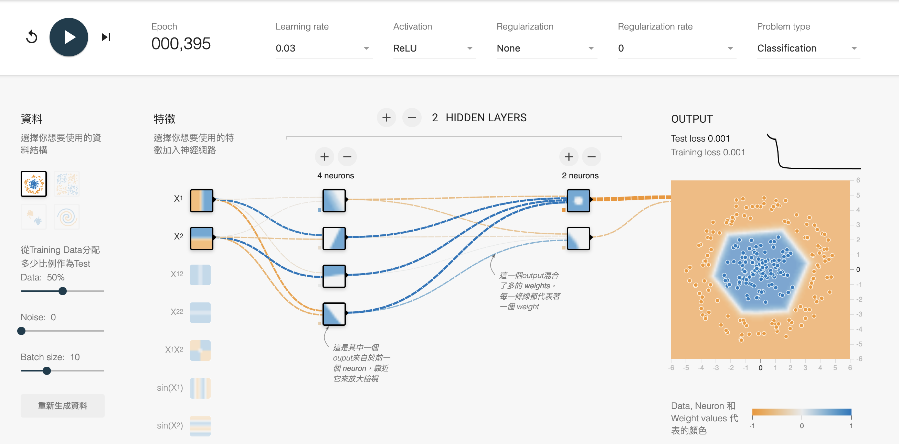

而增加一層後，約兩百多個 epoch 就能降低到 0.001：

最終甚至能達到 0.000：
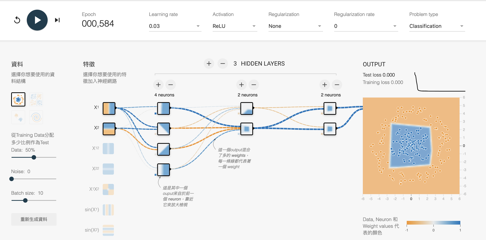

### 3. Playing with the Spiral dataset (bottom right)
#### 3-1: Changing the activation function

##### ReLU
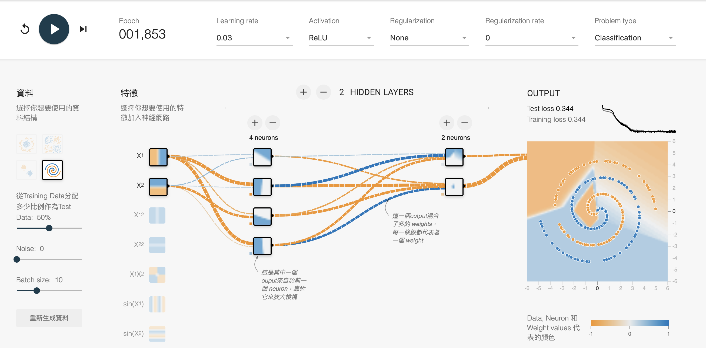
訓練結果明顯沒有 circle 好，且 loss 曲線震顫明顯，跑了許多 epoch 後，結果仍不是非常穩定

##### Tanh
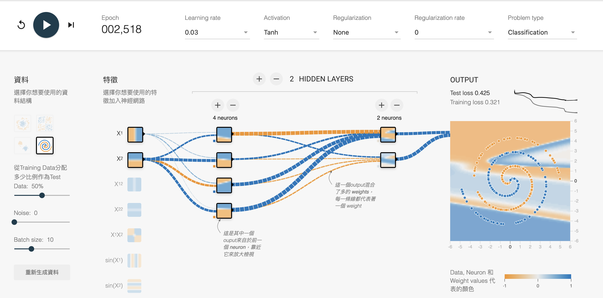
使用 tanh 特別的現象是 train loss 和 test loss 差距比其他三者都來得大

##### Sigmoid
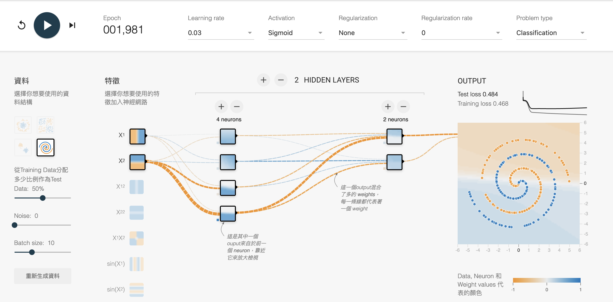
Sigmoid 的 train loss 和 test loss 略有差距。
觀察資料點的分佈圖，可以發現 Sigmoid 在處理這樣的資料非常無力，幾乎是直接畫一條水平線來分類

##### Linear
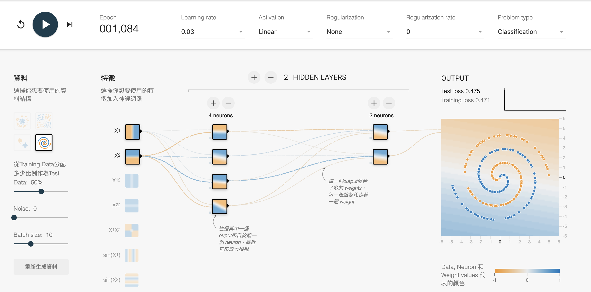
Linear 線性切分 Spiral 資料，分佈圖看起來和 Sigmoid 非常相近
兩者的預測結果也是 loss 最大的。

#### 3-2: Changing the number of layers
再重新生成一次資料，這次使用預設的兩層 hidden layer

##### 2 layers
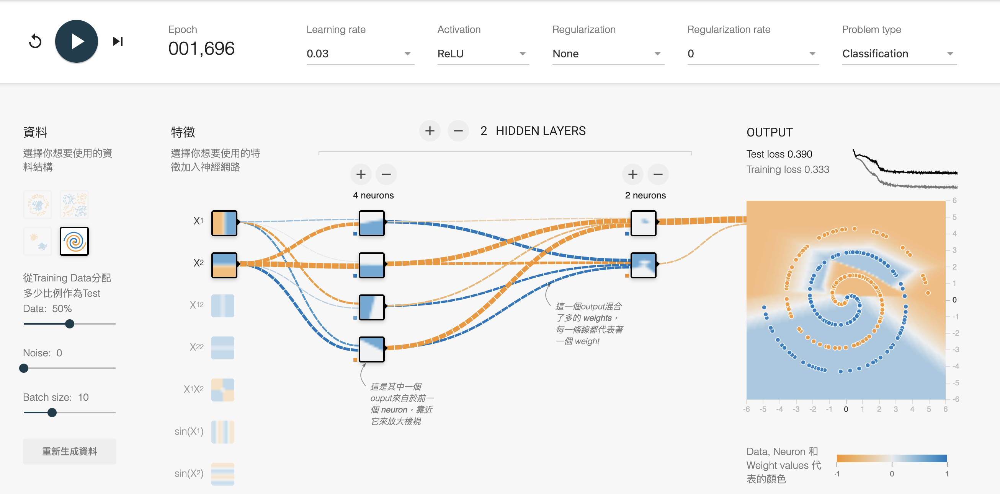
表現普通

##### 4 layers
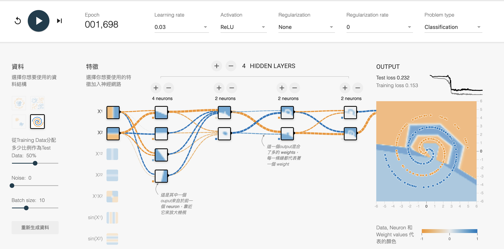
增加到四層，可以發現邊界有一點點被畫出來，loss 也變小

##### 6 layers
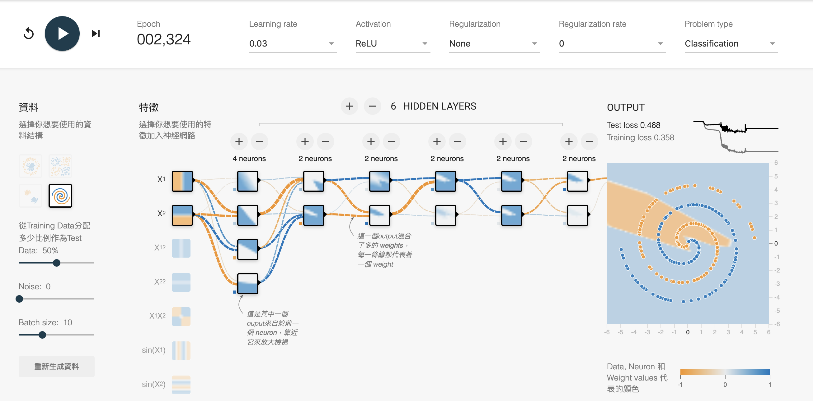
但是繼續加的效果未必好，看 train loss 和 test loss 可以發現似乎有點過度擬和

#### 3-3: Adding additional features
在先前最佳案例（4 hidden layers + ReLU）之下嘗試加入不同特徵

##### 6 features
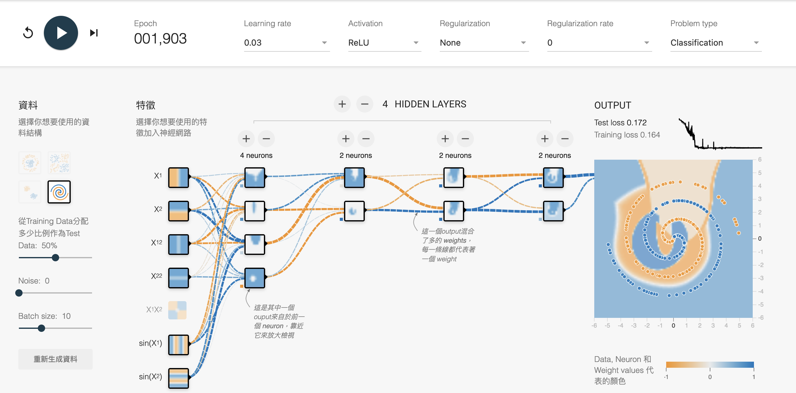
加入另外四個特徵，表現更好，但仍有較奇怪的地方（右上）

##### 7 features
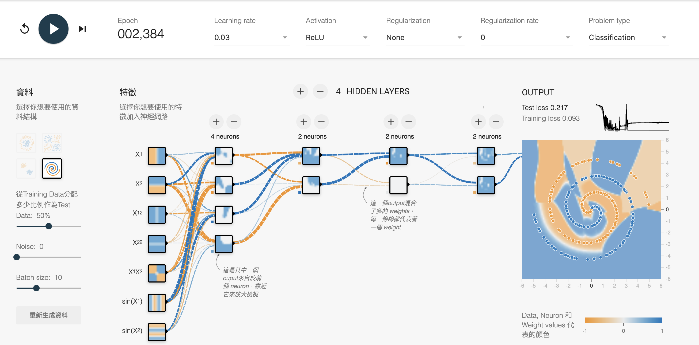
特徵全加，表現反而沒有上升

然而，若我們改動其他題目規定以外的選項，試圖提升模型準確率時（這裡增加了神經元數），會發現似乎仍是特徵全選的訓練效果較好：

##### 6 features
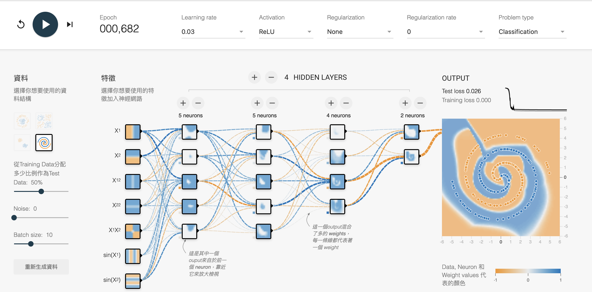

##### 7 features
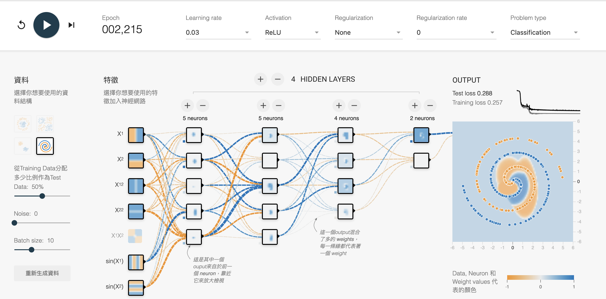